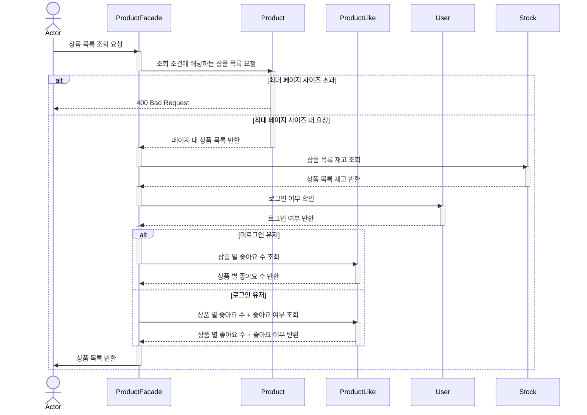
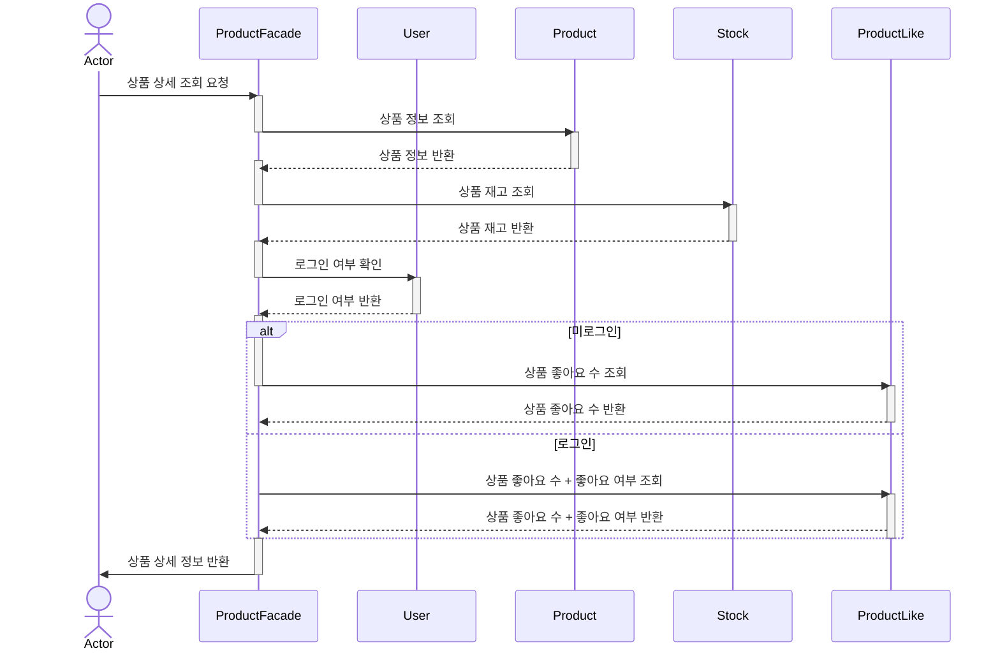
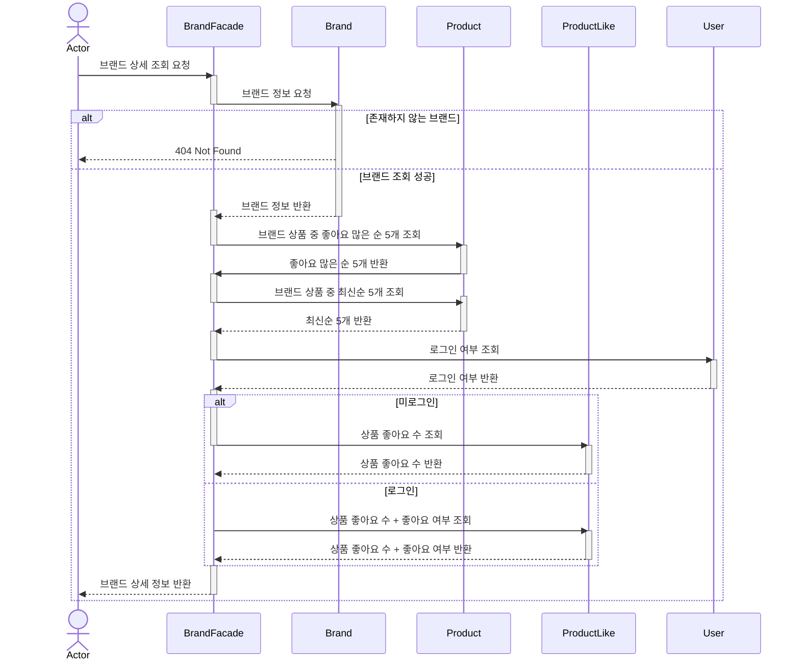
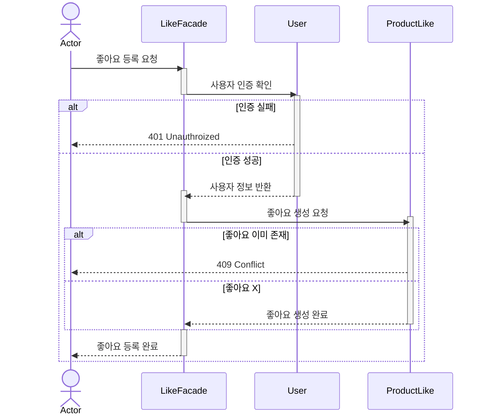
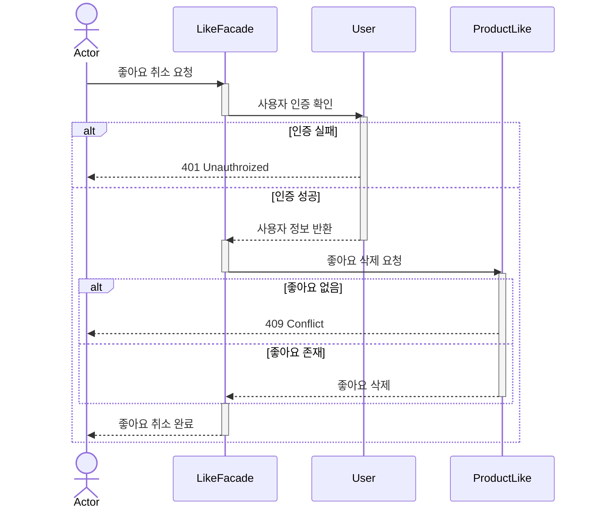
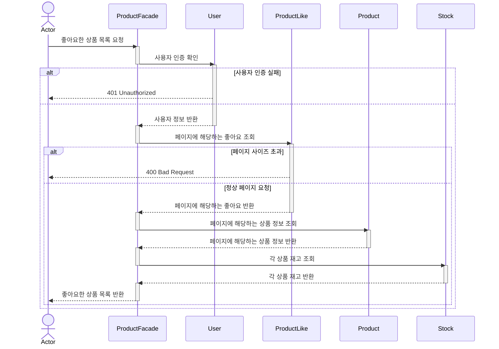
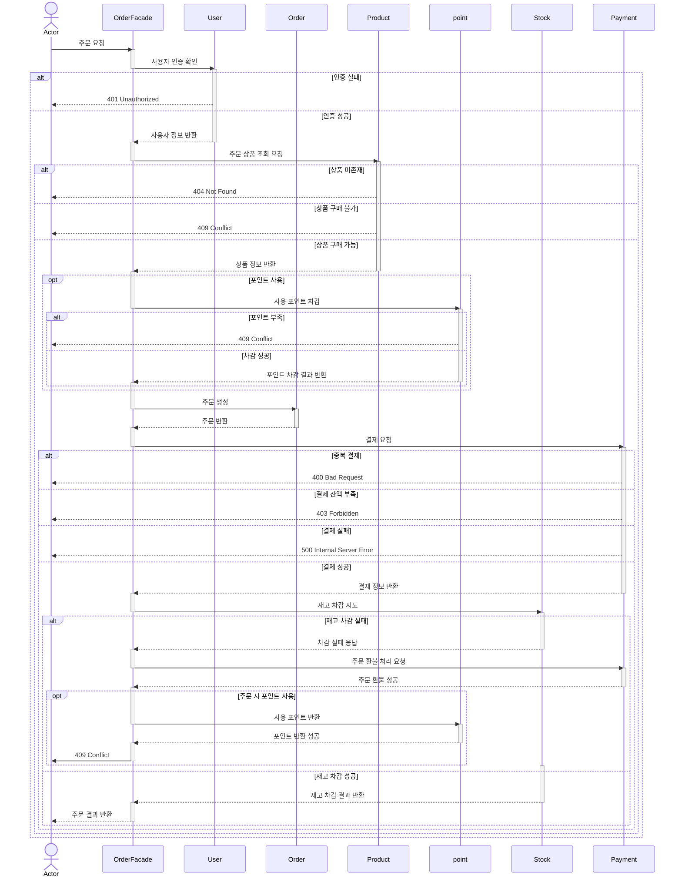
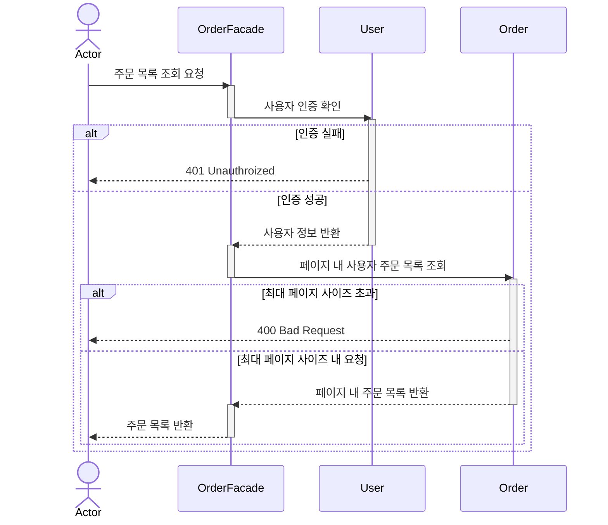
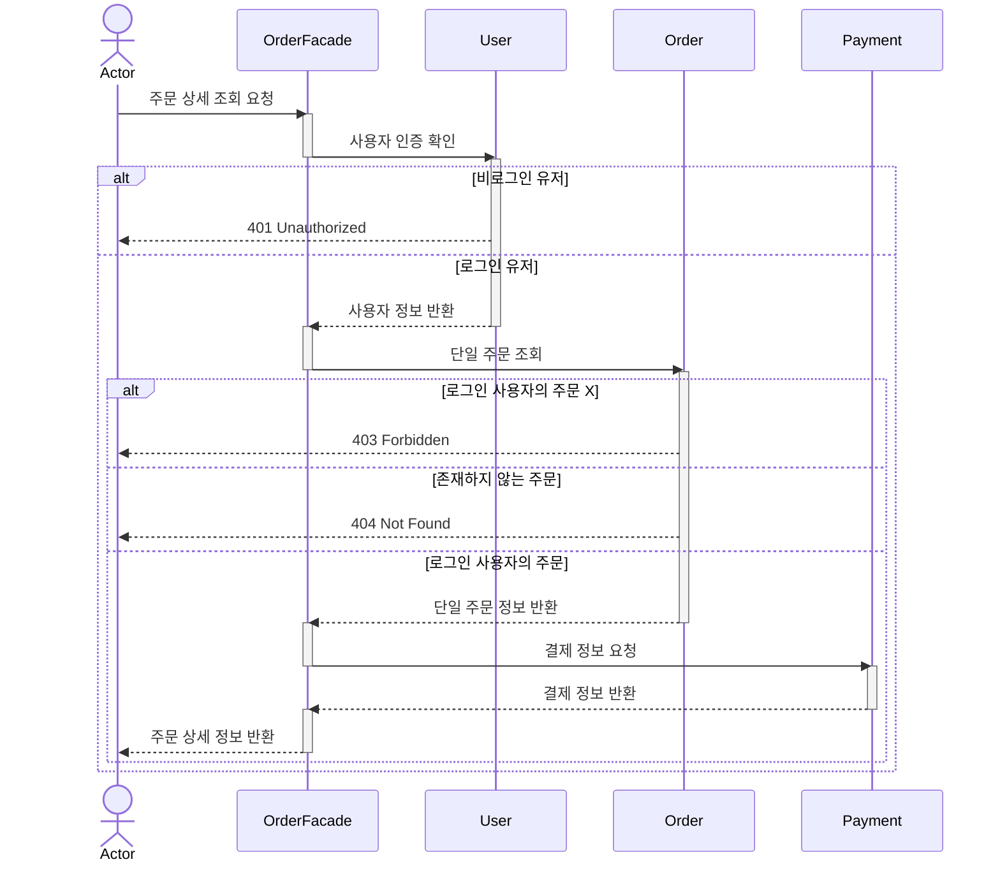

# 상품 목록 조회

```mermaid
sequenceDiagram
  Actor A as Actor
  participant PF as ProductFacade
  participant P as Product
  participant L as ProductLike
  participant U as User
  participant S as Stock
  
  A->>PF: 상품 목록 조회 요청
  activate PF
  PF->>P: 조회 조건에 해당하는 상품 목록 요청
  deactivate PF
  activate P
  alt 최대 페이지 사이즈 초과
    P-->>A: 400 Bad Request
  else 최대 페이지 사이즈 내 요청
    P-->>PF: 페이지 내 상품 목록 반환
    deactivate P
    activate PF
    PF->>S: 상품 목록 재고 조회
    deactivate PF
    activate S
    S-->>PF: 상품 목록 재고 반환
    deactivate S
    activate PF
    PF->>U: 로그인 여부 확인
    deactivate PF
    activate U
    U-->>PF: 로그인 여부 반환
    deactivate U
    activate PF
    alt 미로그인 유저
      PF->>L: 상품 별 좋아요 수 조회
      deactivate PF
      activate L
      L-->>PF: 상품 별 좋아요 수 반환
      deactivate L
    else 로그인 유저
      PF->>L: 상품 별 좋아요 수 + 좋아요 여부 조회
      activate L
      L-->>PF: 상품 별 좋아요 수 + 좋아요 여부 반환
    end
      deactivate L
      activate PF
      PF->>A: 상품 목록 반환
      deactivate PF
  end
```

# 상품 상세

```mermaid
sequenceDiagram
  actor A as Actor
  participant PF as ProductFacade
  participant U as User
  participant P as Product
  participant S as Stock
  participant L as ProductLike
  
  A->>PF: 상품 상세 조회 요청
  activate PF
  PF->>P: 상품 정보 조회
  deactivate PF
  activate P
  P-->>PF: 상품 정보 반환
  activate PF
  deactivate P
  PF->>S: 상품 재고 조회
  deactivate PF
  activate S
  S-->>PF: 상품 재고 반환
  deactivate S
  activate PF
  PF->>U: 로그인 여부 확인
  deactivate PF
  activate U
  U-->>PF: 로그인 여부 반환
  deactivate U
  activate PF
  alt 미로그인
    PF->>L: 상품 좋아요 수 조회
    deactivate PF
    activate L
    L-->>PF: 상품 좋아요 수 반환
    deactivate L
  else 로그인
    PF->>L: 상품 좋아요 수 + 좋아요 여부 조회
    activate L
    L-->>PF: 상품 좋아요 수 + 좋아요 여부 반환
  end
    deactivate L
    activate PF
    PF->>A: 상품 상세 정보 반환
    deactivate PF
  
 
  
```

# 브랜드 조회

```mermaid
sequenceDiagram
  Actor A as Actor
  Participant BF as BrandFacade
  Participant B as Brand
  Participant P as Product
  Participant L as ProductLike
  Participant U as User
  
  A->>BF: 브랜드 상세 조회 요청
  activate BF
  BF->>B: 브랜드 정보 요청
  deactivate BF
  activate B
  alt 존재하지 않는 브랜드
    B-->>A: 404 Not Found
  else 브랜드 조회 성공
    B-->>BF: 브랜드 정보 반환
    activate BF
    deactivate B
    BF->>P: 브랜드 상품 중 좋아요 많은 순 5개 조회
    deactivate BF
    activate P
    P->>BF: 좋아요 많은 순 5개 반환
    deactivate P
    activate BF
    BF->>P: 브랜드 상품 중 최신순 5개 조회
    activate P
    deactivate BF
    P-->>BF: 최신순 5개 반환
    deactivate P
    activate BF
    BF->>U: 로그인 여부 조회
    deactivate BF
    activate U
    U-->>BF: 로그인 여부 반환
    deactivate U
    activate BF
    alt 미로그인
      BF->>L: 상품 좋아요 수 조회
      deactivate BF
      activate L
      L-->>BF: 상품 좋아요 수 반환
      deactivate L
    else 로그인
      BF->>L: 상품 좋아요 수 + 좋아요 여부 조회
      activate L
      L-->>BF: 상품 좋아요 수 + 좋아요 여부 반환
      deactivate L
    end
    activate BF
    BF-->>A : 브랜드 상세 정보 반환
    deactivate BF
  end
  
```

# 상품 좋아요 등록/취소

## 좋아요 등록

```mermaid
sequenceDiagram
  Actor A as Actor
  Participant LF as LikeFacade
  Participant U as User
  Participant L as ProductLike
  
    A->>LF: 좋아요 등록 요청
    activate LF
    LF->>U: 사용자 인증 확인
    deactivate LF
    activate U
    alt 인증 실패
      U-->>A: 401 Unauthroized
    else 인증 성공
      U-->>LF: 사용자 정보 반환
      activate LF
      deactivate U
      LF->>L: 좋아요 생성 요청
      activate L
      deactivate LF
      alt 좋아요 이미 존재
        L-->>A: 409 Conflict
      else 좋아요 X
        L-->>LF: 좋아요 생성 완료
        deactivate L
      end
      activate LF
      LF-->>A: 좋아요 등록 완료
      deactivate LF
    end
  
```

## 좋아요 취소

```mermaid
sequenceDiagram
  Actor A as Actor
  Participant LF as LikeFacade
  Participant U as User
  Participant L as ProductLike
    A->>LF:좋아요 취소 요청
    activate LF
    LF->>U: 사용자 인증 확인
    deactivate LF
    activate U
    alt 인증 실패
      U-->>A: 401 Unauthroized
    else 인증 성공
      U-->>LF: 사용자 정보 반환
      deactivate U
      activate LF
      LF->>L: 좋아요 삭제 요청
      deactivate LF
      activate L
      alt 좋아요 없음
        L-->>A: 409 Conflict
      else 좋아요 존재
        L-->>LF: 좋아요 삭제
        deactivate L
      end
      activate LF
      LF-->>A: 좋아요 취소 완료
      deactivate LF
    end
```

# 내가 좋아요한 상품 목록 조회

```mermaid
sequenceDiagram
  Actor A as Actor
  Participant PF as ProductFacade
  Participant U as User
  Participant L as ProductLike
  Participant P as Product
  Participant S as Stock
  
  A->>PF: 좋아요한 상품 목록 요청
  activate PF
  PF->>U: 사용자 인증 확인
  deactivate PF
  activate U
  alt 사용자 인증 실패
    U-->>A: 401 Unauthorized
  else
    U-->>PF: 사용자 정보 반환
    deactivate U
    activate PF
    PF->>L: 페이지에 해당하는 좋아요 조회
    deactivate PF
    activate L
    alt 페이지 사이즈 초과
      L-->>A: 400 Bad Request
    else 정상 페이지 요청
      L-->>PF: 페이지에 해당하는 좋아요 반환
      deactivate L
      activate PF
      PF->>P: 페이지에 해당하는 상품 정보 조회
      deactivate PF
      activate P
      P-->>PF: 페이지에 해당하는 상품 정보 반환
      deactivate P
      activate PF
      PF->>S: 각 상품 재고 조회
      deactivate PF
      activate S
      S-->>PF: 각 상품 재고 반환
      deactivate S
      activate PF
      PF-->>A: 좋아요한 상품 목록 반환
      deactivate PF
      end
  end
```

# 주문 생성 및 결제 흐름

```mermaid
sequenceDiagram
  Actor A as Actor
  Participant OF as OrderFacade
  Participant U as User
  Participant O as Order
  Participant Pd as Product
  Participant P as point
  Participant S as Stock
  Participant Pay as Payment
  
  A->>OF: 주문 요청
  activate OF
  OF->>U: 사용자 인증 확인
  deactivate OF
  activate U
  alt 인증 실패
    U-->>A: 401 Unauthorized
  else 인증 성공
    U-->>OF: 사용자 정보 반환
    deactivate U
    activate OF
    OF->>Pd: 주문 상품 조회 요청
    deactivate OF
    activate Pd
    alt 상품 미존재
      Pd-->>A: 404 Not Found
    else 상품 구매 불가
      Pd-->>A: 409 Conflict
    else 상품 구매 가능
      Pd-->>OF: 상품 정보 반환
      deactivate Pd     
      activate OF
      opt 포인트 사용
        OF->>P: 사용 포인트 차감
        deactivate OF
        activate P
        alt 포인트 부족
          P-->>A: 409 Conflict
          else 차감 성공
          P-->>OF: 포인트 차감 결과 반환
          deactivate P
          activate OF
          end
      end
      OF->>O: 주문 생성
      deactivate OF
      activate O
      O-->>OF: 주문 반환
      deactivate O
      activate OF
      
      OF->>Pay: 결제 요청
      deactivate OF
      activate Pay
      alt 중복 결제
        Pay-->>A: 400 Bad Request
      else 결제 잔액 부족
        Pay-->>A: 403 Forbidden
      else 결제 실패
        Pay-->>A: 500 Internal Server Error
      else 결제 성공
        Pay-->>OF: 결제 정보 반환
        deactivate Pay
        activate OF
        OF->>S: 재고 차감 시도
        deactivate OF
        activate S
        alt 재고 차감 실패
          S-->>OF: 차감 실패 응답
          deactivate S
          activate OF
          OF->>Pay: 주문 환불 처리 요청
          deactivate OF
          activate Pay
          Pay-->>OF: 주문 환불 성공
          deactivate Pay
          activate OF
          opt 주문 시 포인트 사용
            OF->>P: 사용 포인트 반환
            deactivate OF
            activate P
            P-->>OF: 포인트 반환 성공
            deactivate P
            activate OF
            OF->>A: 409 Conflict
            deactivate OF
          end
          activate S
        else 재고 차감 성공
          S-->>OF: 재고 차감 결과 반환
          deactivate S
          activate OF
          OF-->>A: 주문 결과 반환
          deactivate OF
        end
      end
    end 
    
  end
    
  
  
```

# 유저의 주문 목록 조회

```mermaid
sequenceDiagram
  Actor A as Actor
  Participant OF as OrderFacade
  Participant U as User
  Participant O as Order
  
  A->>OF: 주문 목록 조회 요청
  activate OF
  OF->>U: 사용자 인증 확인
  deactivate OF
  activate U
  alt 인증 실패
    U-->>A: 401 Unauthroized
  else 인증 성공
    U-->>OF: 사용자 정보 반환
    deactivate U
    activate OF
    OF->>O: 페이지 내 사용자 주문 목록 조회
    deactivate OF
    activate O
    alt 최대 페이지 사이즈 초과
      O-->>A: 400 Bad Request
    else 최대 페이지 사이즈 내 요청
      O-->>OF: 페이지 내 주문 목록 반환
      deactivate O
      activate OF
      OF-->>A: 주문 목록 반환
      deactivate OF
    end
  end
  
```

# 단일 주문 상세 조회

```mermaid
sequenceDiagram
  Actor A as Actor
  participant OF as OrderFacade
  participant U as User
  participant O as Order
  participant Pay as Payment
  
  A->>OF: 주문 상세 조회 요청
  activate OF
  OF->>U: 사용자 인증 확인
  deactivate OF
  activate U
  alt 비로그인 유저
    U-->>A: 401 Unauthorized
  else 로그인 유저
    U-->>OF: 사용자 정보 반환
    deactivate U
    activate OF
    OF->>O: 단일 주문 조회
    deactivate OF
    activate O
    alt 로그인 사용자의 주문 X
      O-->>A: 403 Forbidden
    else 존재하지 않는 주문
      O-->>A: 404 Not Found
    else 로그인 사용자의 주문
      O-->>OF: 단일 주문 정보 반환
      deactivate O
      activate OF
      OF->>Pay: 결제 정보 요청
      deactivate OF
      activate Pay
      Pay-->>OF: 결제 정보 반환
      deactivate Pay
      activate OF
      OF-->>A: 주문 상세 정보 반환
      deactivate OF
    end
  end
```