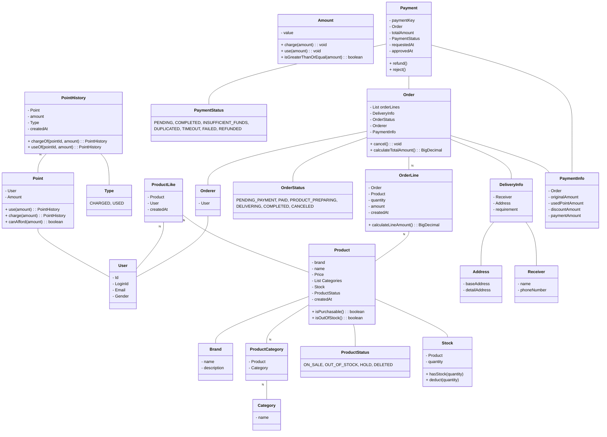

> 클래스 간 연관에 집중하기 위해, 모든 연관관계는 객체로 표현하였습니다.
> 

```mermaid
classDiagram
    %% 사용자 및 포인트 관련
    class User {
        - Id
        - LoginId
        - Email
        - Gender
    }
    class Point {
        - User
        - Amount
        + use(amount) : PointHistory
        + charge(amount) : PointHistory
        + canAfford(amount) : boolean
    }
    class PointHistory {
        - Point
        - amount
        - Type
        - createdAt
        + chargeOf(pointId, amount) : PointHistory
        + useOf(pointId, amount) : PointHistory
    }
    class Amount {
        - value
        + charge(amount) : void
        + use(amount) : void
        + isGreaterThanOrEqual(amount) : boolean
    }
    class Type {
        CHARGED, USED
    }

    %% 상품 관련
    class Brand {
        - name
        - description
    }
    class Category {
        - name
    }
    class ProductCategory {
        - Product
        - Category
    }
    class ProductStatus {
        ON_SALE, OUT_OF_STOCK, HOLD, DELETED
    }
    class Stock {
        - Product
        - quantity
        + hasStock(quantity)
        + deduct(quantity)
    }
    class Product {
        - brand
        - name
        - Price
        - List Categories
        - Stock
        - ProductStatus
        - createdAt
        + isPurchasable() : boolean
        + isOutOfStock() : boolean
    }
    class ProductLike {
        - Product
        - User
        - createdAt
    }

    %% 주문 및 결제 관련
    class Orderer {
        - User
    }
    class OrderStatus {
        PENDING_PAYMENT, PAID, PRODUCT_PREPARING,
        DELIVERING, COMPLETED, CANCELED
    }
    class OrderLine {
        - Order
        - Product
        - quantity
        - amount
        - createdAt
        + calculateLineAmount() : BigDecimal
    }
    class Address {
        - baseAddress
        - detailAddress
    }
    class Receiver {
        - name
        - phoneNumber
    }
    class DeliveryInfo {
        - Receiver
        - Address
        - requirement
    }
    class PaymentStatus {
        PENDING, COMPLETED, INSUFFICIENT_FUNDS,
        DUPLICATED, TIMEOUT, FAILED, REFUNDED
    }
    class Payment {
        - paymentKey
        - Order
        - totalAmount
        - PaymentStatus
        - requestedAt
        - approvedAt
        + refund()
        + reject()
    }
    class PaymentInfo {
        - Order
        - originalAmount
        - usedPointAmount
        - discountAmount
        - paymentAmount
    }
    class Order {
        - List<OrderLine> orderLines
        - DeliveryInfo
        - OrderStatus
        - Orderer
        - PaymentInfo
        + cancel() : void
        + calculateTotalAmount() : BigDecimal
    }

    %% 관계 정의
    Point -- User
    PointHistory "N" -- Point
    PointHistory -- Type

    Product -- Brand
    Product -- "N" ProductCategory
    ProductCategory "N" -- Category
    Product -- Stock
    Product -- ProductStatus
    ProductLike "N" -- Product
    ProductLike "N" -- User

    Orderer -- User
    Order -- Orderer
    Order -- "N" OrderLine
    Order -- OrderStatus
    Order -- DeliveryInfo
    Order -- PaymentInfo
    OrderLine "N" -- Product

    DeliveryInfo -- Receiver
    DeliveryInfo -- Address

    PaymentInfo -- Payment
    Payment -- PaymentStatus
    Payment -- Order
    
```