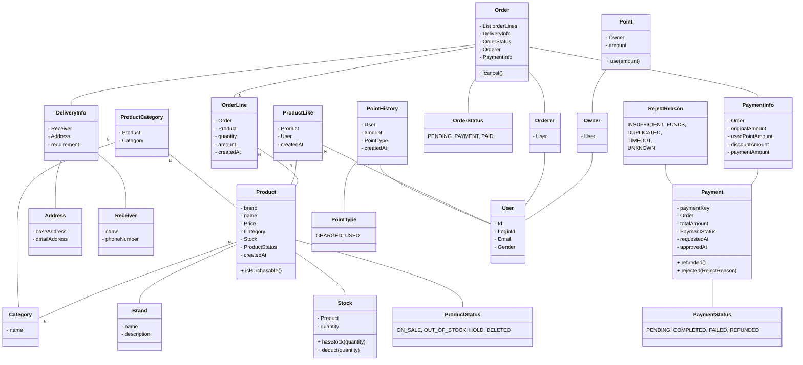

```mermaid
classDiagram
  class Product {
    - brand
    - name
    - Price
    - Category
    - Stock
    - ProductStatus
    - createdAt
    + isPurchasable()
  }
  
  class ProductStatus {
    ON_SALE, OUT_OF_STOCK, HOLD, DELETED
  }
  
  class Stock {
    - Product
    - quantity
    + hasStock(quantity)
    + deduct(quantity)
  }
  
  class Category {
    - name
  }
  
  class ProductCategory {
    - Product
    - Category
  }
  
  class Brand {
    - name
    - description
  }
  
  class ProductLike {
    - Product
    - User
    - createdAt
  }
  
  class OrderLine {
    - Order
    - Product
    - quantity
    - amount
    - createdAt
  }
  
  class Order {
    - List<OrderLine> orderLines
    - DeliveryInfo
    - OrderStatus
    - Orderer
    - PaymentInfo
    + cancel()
  }
  
  class PaymentInfo {
    - Order
    - originalAmount
    - usedPointAmount
    - discountAmount
    - paymentAmount
  }
  
  class DeliveryInfo {
    - Receiver
    - Address
    - requirement
  }
  
  class Address {
    - baseAddress
    - detailAddress
  }
  
  class Receiver {
    - name
    - phoneNumber
  }
  
  class OrderStatus {
    PENDING_PAYMENT, PAID
  }
  
  class Payment {
    - paymentKey
    - Order
    - totalAmount
    - PaymentStatus
    - requestedAt
    - approvedAt
    + refunded()
    + rejected(RejectReason)
  }
  
  class PaymentStatus {
    PENDING, COMPLETED, FAILED, REFUNDED
  }
  
  class RejectReason {
    INSUFFICIENT_FUNDS,
    DUPLICATED,
    TIMEOUT,
    UNKNOWN
  }
  
  class Orderer {
    - User
  }
  
  
  class Point {
    - Owner
    - amount
    + use(amount)
  }
  
  class PointHistory {
    - User
    - amount
    - PointType
    - createdAt
  }
  
  class PointType {
    CHARGED, USED
  }
  
  class Owner {
    - User
  }
  
  class User {
    - Id
    - LoginId
    - Email
    - Gender
  }
  
  Product "N" -- Brand
  Product -- "N" Category
  Product -- Stock
  Product -- ProductStatus
  OrderLine "N" -- Product
  Order -- "N" OrderLine
  Order -- OrderStatus
  ProductLike "N" -- Product
  Point -- Owner
  Owner -- User
  Order -- Orderer
  Orderer -- User
  Order -- DeliveryInfo
  DeliveryInfo -- Receiver
  DeliveryInfo -- Address
  ProductLike "N" -- User
  Order -- PaymentInfo
  PaymentInfo -- Payment
  Payment -- PaymentStatus
  RejectReason -- Payment
  ProductCategory "N" -- Product
  ProductCategory "N" -- Category
  PointHistory -- User
  PointHistory -- PointType
  
```