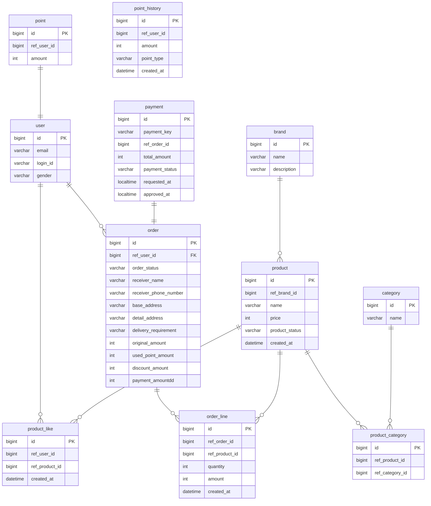

```mermaid
erDiagram
  product {
    bigint id PK
    bigint ref_brand_id
    varchar name
    int price
    varchar product_status
    datetime created_at
  }
  
  product_category {
    bigint id PK
    bigint ref_product_id
    bigint ref_category_id
  }
  
  category {
    bigint id PK
    varchar name
  }
  
  order_line {
    bigint id PK
    bigint ref_order_id
    bigint ref_product_id
    int quantity
    int amount
    datetime created_at
  }
  
  product_like {
    bigint id PK
    bigint ref_user_id
    bigint ref_product_id
    datetime created_at
  }
  
  point {
    bigint id PK
    bigint ref_user_id
    int amount
  }
  
  point_history {
    bigint id PK
    bigint ref_user_id
    int amount
    varchar point_type
    datetime created_at
  }
  
  brand {
    bigint id PK
    varchar name
    varchar description
  }
  
  order {
    bigint id PK
    bigint ref_user_id FK
    varchar order_status
    varchar receiver_name
    varchar receiver_phone_number
    varchar base_address
    varchar detail_address
    varchar delivery_requirement
    int original_amount
    int used_point_amount
    int discount_amount
    int payment_amountdd
  }
  
  user {
    bigint id PK
    varchar email
    varchar login_id
    varchar gender
  }
  
  payment {
    bigint id PK
    varchar payment_key
    bigint ref_order_id
    int total_amount
    varchar payment_status
    localtime requested_at
    localtime approved_at
  }
  
  
  brand ||--o{ product : ""
  point ||--|| user : ""
  user ||--o{ product_like :""
  product ||--o{ product_like: ""
  order ||--o{ order_line :""
  user ||--o{ order : ""
  product ||--o{ order_line: ""
  product ||--o{ product_category: ""
  category ||--o{ product_category: ""
  payment ||--|| order : ""
```